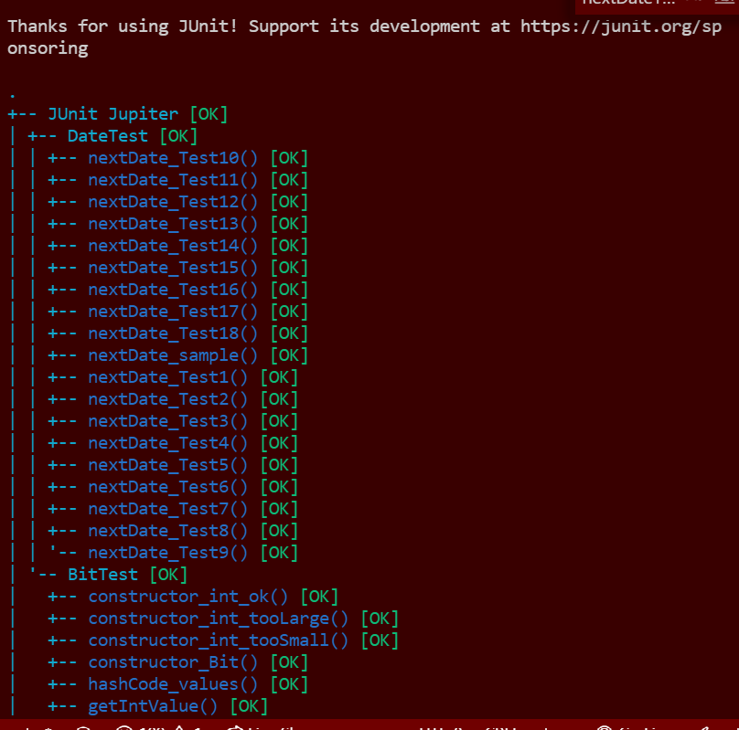
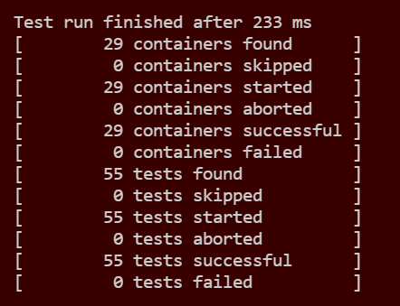

# Lab 02

| Outline | Value |
| --- | --- |
| Course | SEG 3103 |
| Date | Summer 2021 |
| Professor | Andrew Forward, aforward@uottawa.ca |
| TA | zchen229@uottawa.ca |
| Team | Ali Aftab, Muhammad 300067438 |

## Terminal Output to Run Jar File
This is a description on how to start up the jar file and how to run the localhost...

## Localhost:8080

## Table Output

## Table Output Part 2

## Test for Exercise 1

## Test for Exercise 2

