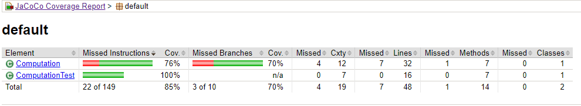
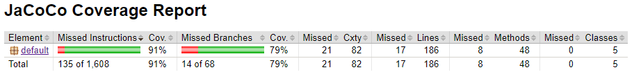
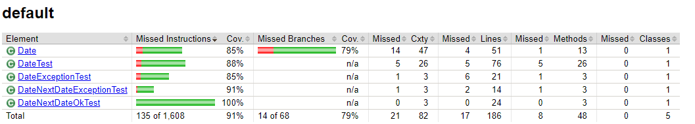
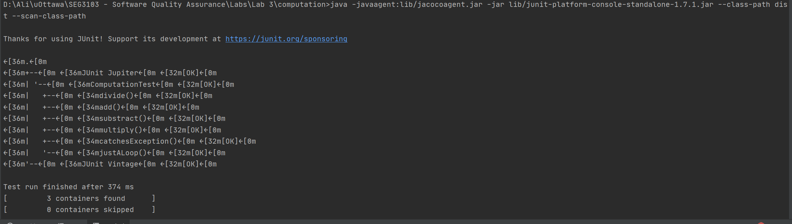
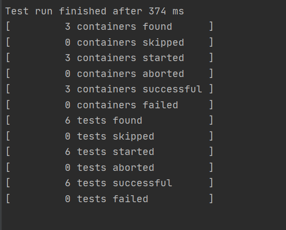
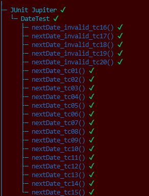
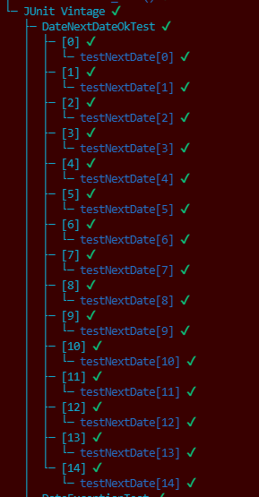
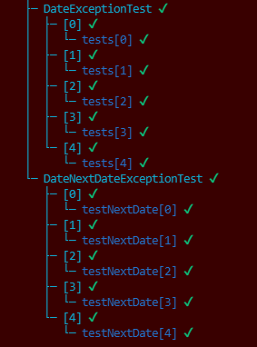
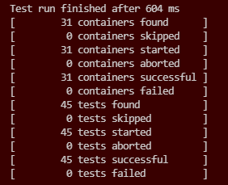

# Lab 03

| Outline | Value |
| --- | --- |
| Course | SEG 3103 |
| Date | Summer 2021 |
| Professor | Andrew Forward, aforward@uottawa.ca |
| TA | n.bayati@uottawa.ca |
| Team | Ali Aftab, Muhammad 300067438 |

## System
Using Windows 10

## Compile and Run:
javac -encoding UTF-8 --source-path test -d dist -cp lib/junit-platform-console-standalone-1.7.1.jar testForX100/DateTest.java src/*.java

java -javaagent:lib/jacocoagent.jar -jar lib/junit-platform-console-standalone-1.7.1.jar --class-path dist --scan-class-path

## Generate Report
java -jar lib/jacococli.jar report jacoco.exec --classfiles dist --sourcefiles src --html report

## Code Coverage

## JUnit Test

## JUnit Test Date

