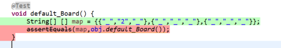
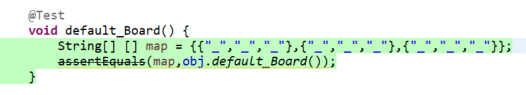

# Lab 04

| Outline | Value |
| --- | --- |
| Course | SEG 3103 |
| Date | Summer 2021 |
| Professor | Andrew Forward, aforward@uottawa.ca |
| TA | n.bayati@uottawa.ca |
| Team | Ali Aftab, Muhammad 300067438 |

## System
Using Windows 10

# Test Driven Development 

## Compile:
javac -encoding UTF-8 --source-path test -d dist -cp lib/junit-platform-console-standalone-1.7.1.jar test/*.java src/*.java 

## Run:
java -jar lib/junit-platform-console-standalone-1.7.1.jar --class-path dist --scan-class-path

## Commit # 1 - Added failing test 

## Commit # 2 - Added passing test 

