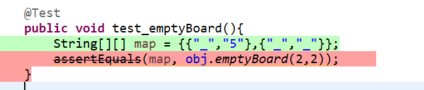
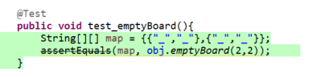
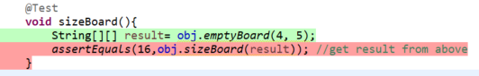
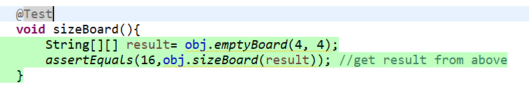
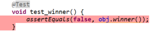
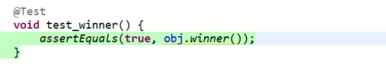
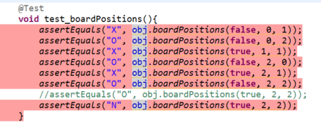
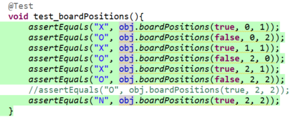

# Lab 04

| Outline | Value |
| --- | --- |
| Course | SEG 3103 |
| Date | Summer 2021 |
| Professor | Andrew Forward, aforward@uottawa.ca |
| TA | n.bayati@uottawa.ca |
| Team | Ali Aftab, Muhammad 300067438 |

## System
Using Windows 10

# Test Driven Development 

## Compile:
javac -encoding UTF-8 --source-path test -d dist -cp lib/junit-platform-console-standalone-1.7.1.jar test/*.java src/*.java 

## Run:
java -jar lib/junit-platform-console-standalone-1.7.1.jar --class-path dist --scan-class-path

# Commit # 1 
## Added failing test - default_Board

## Added passing test - default_Board

## Commit

# Commit # 2
## Added failing test - emptyBoard

## Added passing test - emptyBoard

## Commit

# Commit # 3
## Added failing test - sizeBoard

## Added passing test - sizeBoard

## Commit

# Commit # 4 
## Added failing test - test_winner

## Added passing test - test_winner

## Commit

# Commit # 5
## Added failing test - test_boardPositions

## Added passing test - test_boardPositions

## Commit

# Refactor
